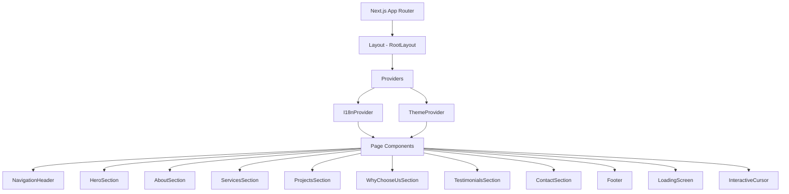

# Tài liệu Thiết kế - WiWi Landing Page

## Tổng quan (Overview)

WiWi Landing Page là một trang web đơn trang (SPA) giới thiệu công ty công nghệ WiWi, được xây dựng trên nền tảng Next.js 14+ (App Router), React 18, và TailwindCSS. Trang sử dụng dark theme với phong cách futuristic/high-tech, tích hợp hệ thống đa ngôn ngữ (Tiếng Việt/Tiếng Anh), animation cao cấp qua Framer Motion, và responsive trên mọi thiết bị.

Trang bao gồm các section chính: Hero, About, Services, Projects, Why Choose Us, Testimonials, Contact, và Footer, tất cả được kết nối qua Navigation Header cố định với smooth scroll.

## Kiến trúc (Architecture)

### Kiến trúc tổng thể



### Công nghệ sử dụng

| Công nghệ | Mục đích |
|---|---|
| Next.js 14+ (App Router) | Framework chính, SSR/SSG, routing |
| React 18 | UI library |
| TailwindCSS 3 | Styling, responsive, dark theme |
| Framer Motion | Animation, scroll animation, transitions |
| next-intl hoặc custom i18n | Hệ thống đa ngôn ngữ |
| tsparticles | Particle background cho Hero |
| next/image | Tối ưu hình ảnh |
| React Hook Form + Zod | Form validation cho Contact |

### Cấu trúc thư mục

```
src/
├── app/
│   ├── layout.tsx          # Root layout với providers
│   ├── page.tsx            # Trang chính, compose các section
│   └── globals.css         # Global styles, TailwindCSS
├── components/
│   ├── layout/
│   │   ├── NavigationHeader.tsx
│   │   └── Footer.tsx
│   ├── sections/
│   │   ├── HeroSection.tsx
│   │   ├── AboutSection.tsx
│   │   ├── ServicesSection.tsx
│   │   ├── ProjectsSection.tsx
│   │   ├── WhyChooseUsSection.tsx
│   │   ├── TestimonialsSection.tsx
│   │   └── ContactSection.tsx
│   ├── ui/
│   │   ├── ServiceCard.tsx
│   │   ├── ProjectCard.tsx
│   │   ├── TestimonialCard.tsx
│   │   ├── AnimatedCounter.tsx
│   │   ├── CTAButton.tsx
│   │   ├── GlassCard.tsx
│   │   ├── ParticleBackground.tsx
│   │   ├── InteractiveCursor.tsx
│   │   └── LoadingScreen.tsx
│   └── providers/
│       └── I18nProvider.tsx
├── hooks/
│   ├── useI18n.ts
│   ├── useScrollAnimation.ts
│   └── useAnimatedCounter.ts
├── lib/
│   ├── i18n.ts             # Logic i18n core
│   └── validation.ts       # Form validation schemas
├── locales/
│   ├── vi.json
│   └── en.json
└── types/
    └── index.ts
```


## Thành phần và Giao diện (Components and Interfaces)

### 1. I18nProvider & useI18n Hook

Provider quản lý trạng thái ngôn ngữ toàn cục, cung cấp hàm `t(key)` để dịch nội dung.

```typescript
interface I18nContextType {
  locale: 'vi' | 'en';
  t: (key: string) => string;
  setLocale: (locale: 'vi' | 'en') => void;
}
```

- Lưu locale vào `localStorage` với key `wiwi-locale`
- Mặc định `vi` khi không có giá trị trong localStorage
- Chuyển ngôn ngữ không reload trang (React state update)

### 2. NavigationHeader

Thanh điều hướng cố định (sticky) với glassmorphism effect.

```typescript
interface NavItem {
  id: string;       // section id để smooth scroll
  labelKey: string;  // i18n key cho label
}
```

- Sticky position với `backdrop-blur` khi scroll
- Smooth scroll qua `scrollIntoView({ behavior: 'smooth' })`
- Hamburger menu trên mobile (< 768px) với Framer Motion animation
- Nút chuyển ngôn ngữ EN/VI

### 3. HeroSection

Section đầu tiên với particle background và staggered entrance animation.

- Tiêu đề với gradient text (`bg-clip-text text-transparent bg-gradient-to-r`)
- Particle background qua `@tsparticles/react` hoặc CSS animated gradient fallback
- 2 CTA buttons với glow effect on hover
- Staggered fade-in + slide-up animation qua Framer Motion `variants`

### 4. ServiceCard

Card dịch vụ với glassmorphism và hover effects.

```typescript
interface ServiceCardProps {
  icon: React.ReactNode;
  titleKey: string;
  descriptionKey: string;
}
```

- Glassmorphism: `bg-white/5 backdrop-blur-md border border-white/10`
- Hover: glow border (`box-shadow` neon), `scale(1.03)`, gradient shift
- Stagger animation khi scroll vào viewport

### 5. ProjectCard

Card dự án với overlay effect.

```typescript
interface ProjectCardProps {
  image: string;
  titleKey: string;
  descriptionKey: string;
  technologies: string[];
}
```

- Grid layout: 1 cột (mobile), 2 cột (tablet), 3-4 cột (desktop)
- Hover overlay với thông tin chi tiết + scale effect
- Lazy loading cho hình ảnh qua `next/image`

### 6. AnimatedCounter

Component đếm số liệu với animation.

```typescript
interface AnimatedCounterProps {
  target: number;
  duration?: number; // 1.5 - 2.5 giây
  suffix?: string;   // ví dụ: "+", "%"
  label: string;
}
```

- Sử dụng `useInView` từ Framer Motion để trigger
- Animation đếm từ 0 đến target qua `requestAnimationFrame`
- Chỉ chạy một lần khi element vào viewport

### 7. TestimonialCarousel

Carousel đánh giá khách hàng.

```typescript
interface Testimonial {
  name: string;
  position: string;
  company: string;
  avatar: string;
  contentKey: string;
}
```

- Auto-play mỗi 5 giây, pause on hover/touch
- Swipe support trên mobile qua Framer Motion drag
- Navigation dots/arrows trên desktop
- Glassmorphism card style

### 8. ContactForm

Form liên hệ với validation.

```typescript
interface ContactFormData {
  fullName: string;
  email: string;
  phone?: string;
  message: string;
}
```

- Validation qua Zod schema:
  - `fullName`: required, non-empty sau trim
  - `email`: required, format email hợp lệ (chứa @ và domain)
  - `phone`: optional
  - `message`: required, non-empty sau trim
- Glow border effect khi focus input
- Success animation sau khi submit thành công

### 9. InteractiveCursor

Custom cursor effect chỉ trên desktop.

- Theo dõi vị trí chuột qua `mousemove` event
- Glow effect xung quanh cursor
- Ẩn trên thiết bị touch/mobile
- Sử dụng `requestAnimationFrame` cho smooth tracking

### 10. LoadingScreen

Màn hình loading khi trang đang tải.

- Logo WiWi với pulse/glow animation
- Fade-out khi trang đã tải xong
- Dark theme phù hợp với tổng thể

## Mô hình Dữ liệu (Data Models)

### Locale Files Structure

```typescript
// types/index.ts
type Locale = 'vi' | 'en';

interface LocaleMessages {
  nav: {
    about: string;
    services: string;
    projects: string;
    whyUs: string;
    testimonials: string;
    contact: string;
  };
  hero: {
    title: string;
    subtitle: string;
    ctaPrimary: string;
    ctaSecondary: string;
  };
  about: {
    title: string;
    description: string;
  };
  services: {
    title: string;
    items: Array<{
      title: string;
      description: string;
    }>;
  };
  projects: {
    title: string;
    items: Array<{
      title: string;
      description: string;
    }>;
  };
  whyUs: {
    title: string;
    points: Array<{
      title: string;
      description: string;
    }>;
    stats: Array<{
      value: number;
      suffix: string;
      label: string;
    }>;
  };
  testimonials: {
    title: string;
    items: Array<{
      name: string;
      position: string;
      company: string;
      content: string;
    }>;
  };
  contact: {
    title: string;
    fullName: string;
    email: string;
    phone: string;
    message: string;
    submit: string;
    success: string;
    errors: {
      fullNameRequired: string;
      emailRequired: string;
      emailInvalid: string;
      messageRequired: string;
    };
  };
  footer: {
    copyright: string;
    address: string;
  };
}
```

### Contact Form Validation Schema

```typescript
// lib/validation.ts
import { z } from 'zod';

export const contactFormSchema = z.object({
  fullName: z.string().trim().min(1, 'required'),
  email: z.string().trim().min(1, 'required').email('invalid'),
  phone: z.string().optional(),
  message: z.string().trim().min(1, 'required'),
});

export type ContactFormData = z.infer<typeof contactFormSchema>;
```


## Correctness Properties

*Một property (thuộc tính đúng đắn) là một đặc điểm hoặc hành vi phải luôn đúng trong mọi lần thực thi hợp lệ của hệ thống — về cơ bản là một phát biểu hình thức về những gì hệ thống phải làm. Properties đóng vai trò cầu nối giữa đặc tả dễ đọc cho con người và đảm bảo tính đúng đắn có thể kiểm chứng bằng máy.*

Phần lớn yêu cầu của WiWi Landing Page liên quan đến UI rendering, styling, và animation — không phù hợp cho property-based testing. Tuy nhiên, các logic thuần túy sau đây có thể kiểm chứng bằng PBT:

### Property 1: i18n translation lookup consistency

*For any* valid translation key tồn tại trong cả vi.json và en.json, khi chuyển locale sang 'en' thì `t(key)` phải trả về giá trị từ en.json, và khi chuyển sang 'vi' thì `t(key)` phải trả về giá trị từ vi.json.

**Validates: Requirements 3.3**

### Property 2: i18n locale persistence round-trip

*For any* locale hợp lệ ('vi' hoặc 'en'), sau khi gọi `setLocale(locale)`, giá trị đọc từ `localStorage.getItem('wiwi-locale')` phải bằng chính locale đã set.

**Validates: Requirements 3.4**

### Property 3: Contact form validation rejects missing required fields

*For any* ContactFormData mà trường `fullName` hoặc `email` hoặc `message` là chuỗi rỗng hoặc chỉ chứa whitespace, validation schema phải trả về lỗi cho trường tương ứng và form không được chấp nhận.

**Validates: Requirements 10.3**

### Property 4: Contact form email format validation

*For any* chuỗi không chứa ký tự `@` hoặc không có domain hợp lệ sau `@`, khi đặt làm giá trị email trong ContactFormData, validation schema phải trả về lỗi định dạng email. Ngược lại, *for any* email có định dạng hợp lệ (user@domain.tld), validation phải chấp nhận trường email.

**Validates: Requirements 10.4**

### Property 5: AnimatedCounter converges to target

*For any* số nguyên dương `target`, logic đếm của AnimatedCounter phải kết thúc tại đúng giá trị `target` (không vượt quá, không dừng sớm).

**Validates: Requirements 8.3**

## Xử lý Lỗi (Error Handling)

### Form Validation Errors
- Hiển thị thông báo lỗi inline dưới mỗi trường input bị lỗi
- Thông báo lỗi được dịch theo ngôn ngữ hiện tại qua i18n
- Các trường lỗi có viền đỏ thay vì glow neon
- Validation chạy on-blur và on-submit

### i18n Fallback
- Nếu key không tồn tại trong locale file, trả về key gốc (fallback)
- Nếu localStorage bị lỗi (private browsing), fallback về 'vi'
- Nếu locale file không load được, hiển thị nội dung mặc định (vi)

### Image Loading Errors
- Sử dụng placeholder/skeleton khi hình ảnh đang tải
- Hiển thị fallback image nếu hình ảnh gốc lỗi
- next/image tự động xử lý responsive và format optimization

### Animation Fallback
- Nếu `prefers-reduced-motion` được bật, giảm hoặc tắt animation
- Particle background fallback về static gradient nếu performance thấp
- Interactive cursor tự động ẩn trên thiết bị không hỗ trợ hover

### Network Errors
- Contact form hiển thị thông báo lỗi nếu submit thất bại
- Retry mechanism cho form submission
- Loading state trên submit button để tránh double-submit

## Chiến lược Kiểm thử (Testing Strategy)

### Công cụ Testing

| Công cụ | Mục đích |
|---|---|
| Vitest | Unit test runner |
| React Testing Library | Component testing |
| fast-check | Property-based testing |
| Playwright | E2E testing (optional) |

### Unit Tests (Example-based)

Tập trung vào các trường hợp cụ thể và edge cases:

- **NavigationHeader**: render đúng elements, hamburger menu trên mobile, smooth scroll trigger
- **HeroSection**: render tiêu đề, subheadline, >= 2 CTA buttons
- **ServiceCard**: render icon, title, description; hover class changes
- **ProjectCard**: render image, title, description, technologies; overlay on hover
- **TestimonialCarousel**: render >= 3 items, auto-advance với fake timers, pause on hover
- **ContactForm**: render tất cả fields, success message sau submit, glow on focus
- **Footer**: render logo, contact info, social links, copyright
- **LoadingScreen**: render logo với animation
- **i18n**: default locale là 'vi', locale files có cùng keys

### Property-Based Tests (fast-check)

Mỗi property test chạy tối thiểu 100 iterations:

- **Feature: wiwi-landing-page, Property 1: i18n translation lookup consistency**
  - Generate random keys từ locale file, verify t(key) trả về đúng giá trị theo locale hiện tại
- **Feature: wiwi-landing-page, Property 2: i18n locale persistence round-trip**
  - Generate random locale ('vi' | 'en'), verify localStorage round-trip
- **Feature: wiwi-landing-page, Property 3: Contact form validation rejects missing required fields**
  - Generate random ContactFormData với một hoặc nhiều trường required là empty/whitespace, verify validation fails
- **Feature: wiwi-landing-page, Property 4: Contact form email format validation**
  - Generate random strings (có và không có @domain), verify validation result đúng
- **Feature: wiwi-landing-page, Property 5: AnimatedCounter converges to target**
  - Generate random positive integers, verify counter logic kết thúc tại target

### Snapshot Tests

- Tất cả section components với dark theme styles
- Glassmorphism card styles
- Responsive layouts ở 3 breakpoints

### Accessibility Tests

- Kiểm tra contrast ratio cho text trên dark background
- Kiểm tra touch target sizes >= 44x44px
- Kiểm tra font sizes >= 16px trên mobile
- Kiểm tra keyboard navigation cho form và carousel
